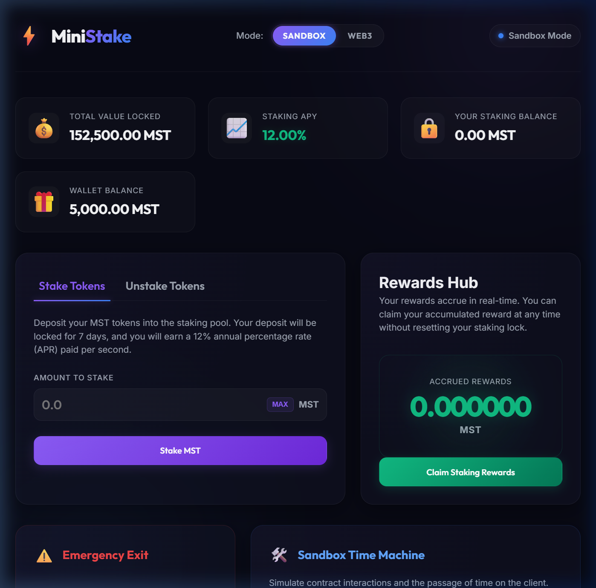

# ⚡ MiniStake — ERC-20 Token & Staking Protocol

MiniStake is a gas-optimized decentralized staking platform where users can request faucet tokens, stake their ERC-20 tokens (MST) to earn APR rewards over time, and claim rewards or execute emergency withdrawals. 

This project demonstrates Solidity custom error implementations, variable packing, storage caching, 25-case Hardhat unit test suites, and a premium glassmorphic frontend interface supporting dual-mode (Web3 & client-side Sandbox Simulation).

---

## 📐 Architecture Diagram

Below is the layout of the inter-contract communication flow:

```
                   +-------------------------------------------------+
                   |                   User Wallet                   |
                   +--------+-------------------------------+---------+
                            |                               |
                            | (1) stake /                   | (4) claimReward()
                            |     unstake /                 |
                            |     emergencyWithdraw()       v
                            v                             +----------------------+
                   +--------+---------+                   |                      |
                   |                  |                   |  RewardDistributor   |
                   |   StakingPool    |                   |                      |
                   |                  |                   +----------^-----------+
                   +--------+---------+                              |
                            |                                        |
                            | (2) updateStakingState(user, balance) /| (3) transfer
                            |     resetReward(user)                  |     rewards
                            +----------------------------------------+
                                                                     |
                                                                     v
                                                          +----------+-----------+
                                                          |                      |
                                                          |   MiniStakeToken     |
                                                          |        (MST)         |
                                                          |                      |
                                                          +----------------------+
```

1. **User Interaction**: Users deposit, withdraw, or trigger emergency exits through `StakingPool`.
2. **State Synchronization**: `StakingPool` calls `RewardDistributor` to checkpoint user rewards *before* any staked balance changes occur, preventing retroactive calculations.
3. **Emergency Penalty**: Calling `emergencyWithdraw` on `StakingPool` skips the lock-up timer but instructs `RewardDistributor` to reset all accumulated rewards to 0.
4. **Reward Claim**: Stakers claim their accumulated MST rewards directly from `RewardDistributor` which transfers reward tokens from its funded reserves.

---

## 🧮 Reward Distribution Formula

Staking rewards accrue continuously at a **12.00% APR** (Annual Percentage Rate) rate computed per-second:

$$\text{Pending Rewards} = \frac{\text{Staked Amount} \times \text{APR BPS} \times \text{Seconds Elapsed}}{\text{BPS Divisor} \times \text{Year in Seconds}}$$

Where:
- $\text{APR BPS} = 1200$ (represents $12.00\%$)
- $\text{BPS Divisor} = 10000$
- $\text{Year in Seconds} = 31,536,000$ ($365 \text{ days}$)

In Solidity, this math is computed inside `RewardDistributor.sol` using gas-optimized division:
```solidity
pending = (currentStaked * APR_BPS * timeElapsed) / (BPS_DIVISOR * YEAR_IN_SECONDS);
```
Accumulated rewards are checkpointed and written to storage under `accumulatedRewards[user]` whenever a balance updates, and `lastUpdateTime[user]` is reset to the current `block.timestamp`.

---

## ⛽ Hardhat Gas Report

This contract implements advanced gas-saving practices (custom errors, SLOAD memory caching, native `uint256` storage slots, and unchecked math blocks). Below is the average gas consumption compiled by `hardhat-gas-reporter` (Solc 0.8.24, Optimizer enabled, runs: 200):

### Deployments
| Contract | Gas Used | % of Block Limit |
|---|---|---|
| **MiniStakeToken** | 727,045 gas | 1.2% |
| **StakingPool** | 633,476 gas | 1.1% |
| **RewardDistributor** | 578,648 gas | 1.0% |

### Core Methods
| Contract | Function | Avg Gas | Number of Calls in Tests |
|---|---|---|---|
| **StakingPool** | `stake` | 157,968 gas | 8 calls |
| **StakingPool** | `unstake` | 88,711 gas | 2 calls |
| **StakingPool** | `emergencyWithdraw` | 58,437 gas | 3 calls |
| **RewardDistributor** | `updateStakingState` | 70,042 gas | 5 calls |
| **RewardDistributor** | `claimReward` | 67,910 gas | 2 calls |
| **RewardDistributor** | `resetReward` | 32,712 gas | 2 calls |

---

## 💻 Deployed Contract Addresses (Sepolia Testnet)

The contracts are deployed and verified on the Sepolia Test Network:
- **MiniStakeToken (MST)**: `0x82c6Fe60A61f084072cB385E930C6C10f27a9851`
- **RewardDistributor**: `0x74AAe4184f6cC74E679B660d3b563293FB903132`
- **StakingPool**: `0xA5153d142A8bf41F831B8B19f6782fFF40C498d0`

---

## 🌐 Dashboard Web App

The application features a premium dark mode layout styled with a glassmorphism aesthetic. It operates in two modes:
1. **Sandbox Simulation Mode** (Default): Simulates all contract calls, balances, and locks directly on the client. Features a **Time Machine** sidebar letting you fast-forward time (+1 hour, +1 day, +7 days) to watch rewards accrue in real time in the UI.
2. **Web3 Mode**: Connects to your MetaMask wallet via Ethers.js v6 to interact directly with the contracts running on your local network.

### Dashboard Preview


---

## 🚀 How to Run Locally

### 1. Install Dependencies
```bash
npm install
```

### 2. Run Tests
```bash
npx hardhat test
```

### 3. Start Local Node & Deploy
In a new terminal:
```bash
npx hardhat node
```
In your main terminal:
```bash
npm run deploy
```

### 4. Start Frontend Dev Server
```bash
npm run dev
```
Open [http://127.0.0.1:5173/](http://127.0.0.1:5173/) in your browser.

---

## 🌐 Deploying to Testnet (Sepolia)

Follow these steps to deploy these contracts to the public Sepolia test network:

### 1. Configure hardhat.config.js
Install `dotenv`:
```bash
npm install dotenv --save-dev
```
Update your [hardhat.config.js](file:///home/murito/StakeChain/hardhat.config.js) to import networks:
```javascript
import "@nomicfoundation/hardhat-toolbox";
import dotenv from "dotenv";
dotenv.config();

export default {
  solidity: {
    version: "0.8.24",
    settings: {
      optimizer: {
        enabled: true,
        runs: 200,
      },
    },
  },
  networks: {
    sepolia: {
      url: process.env.SEPOLIA_RPC_URL || "",
      accounts: process.env.PRIVATE_KEY ? [process.env.PRIVATE_KEY] : [],
    },
  },
};
```

### 2. Create .env Configuration
Create a `.env` file at the root of the project:
```env
SEPOLIA_RPC_URL=https://eth-sepolia.g.alchemy.com/v2/your-api-key-here
PRIVATE_KEY=your-metamask-private-key-without-0x
```

### 3. Deploy
Execute the deployment script on the Sepolia network:
```bash
npx hardhat run scripts/deploy.js --network sepolia
```
Once deployed, copy the new contract addresses into the `CONTRACTS` object at the top of [src/main.js](file:///home/murito/StakeChain/src/main.js).
